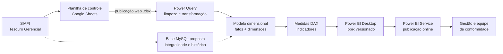

# Conformidade de Registro de Gestão — Data Warehouse e Business Intelligence

**Painel analítico para acompanhamento da conformidade de registro de gestão no setor público federal, construído sobre um modelo dimensional alimentado por dados do SIAFI e do Tesouro Gerencial.**

[](#roadmap)
[](./LICENSE)
[](https://powerbi.microsoft.com/)
[](./apps/conformidade-streamlit/)
[](#)
[](./docs/governanca-de-dados.md)

---

> **Linha de pesquisa.** Este projeto articula **Engenharia de Software e Sistemas de Informação** com **governança de dados aplicada à contabilidade pública**. O artefato técnico — um Data Warehouse dimensional com camada analítica em Power BI — é tratado como objeto de estudo para investigar como princípios de governança (propriedade, classificação, qualidade, linhagem e privacidade) podem ser operacionalizados em uma rotina contábil real. A camada conceitual dessa investigação está em [docs/governanca-de-dados.md](./docs/governanca-de-dados.md).

---

## Sumário

- [Contexto](#contexto)
- [Objetivo](#objetivo)
- [Enquadramento em pesquisa](#enquadramento-em-pesquisa)
- [Arquitetura da solução](#arquitetura-da-solução)
- [Estrutura do repositório](#estrutura-do-repositório)
- [Dashboards e versões](#dashboards-e-versões)
- [Dados](#dados)
- [Stack tecnológica](#stack-tecnológica)
- [Metodologia](#metodologia)
- [Resultados relatados](#resultados-relatados)
- [Roadmap](#roadmap)
- [Como reproduzir](#como-reproduzir)
- [Documentação](#documentação)
- [Governança e privacidade](#governança-e-privacidade)
- [Contribuição](#contribuição)
- [Autor](#autor)
- [Licença](#licença)
- [Referências](#referências)

---

## Contexto

A **conformidade de registro de gestão** é a verificação, por unidade gestora, de que os atos e fatos administrativos registrados no **SIAFI** estão devidamente instruídos, classificados e documentados. É uma atividade obrigatória, recorrente e de alto volume: cada processo precisa ser analisado individualmente, com base em normativos federais que se alteram com frequência.

Nesse cenário, o gargalo não é a análise em si, mas o **esforço acessório** que a cerca:

- dados dispersos entre sistemas estruturantes e controles paralelos em planilhas;
- ausência de visão consolidada sobre volume, distribuição e evolução das análises;
- indicadores apurados manualmente, sem rastreabilidade da origem;
- dificuldade em demonstrar tempestividade e cobertura da análise à gestão e aos órgãos de controle.

O projeto aplica a **Instrução Normativa RFB nº 1.234/2012**, o **DARF Único 6190** e o **Manual de Procedimentos para a Conformidade de Registro de Gestão** da Instituição Federal de Ensino, traduzindo essas regras em um modelo de dados e em indicadores consultáveis.

---

## Objetivo

Construir uma solução de **Data Warehouse** com camada de apresentação em **Power BI** que reduza o tempo necessário para analisar os processos submetidos à conformidade de registro de gestão, oferecendo à equipe e à gestão uma visão confiável, atualizada e rastreável da operação.

**Objetivos específicos:**

1. Modelar os dados de conformidade em esquema dimensional, separando fatos de dimensões.
2. Automatizar a coleta e a atualização dos dados, eliminando digitação manual.
3. Disponibilizar indicadores de volume, distribuição por unidade gestora, tempestividade e situação da análise.
4. Documentar origem, transformação e significado de cada campo utilizado.
5. Estabelecer controles de qualidade e de governança sobre o dado contábil.

---

## Enquadramento em pesquisa

| Dimensão | Posicionamento |
| --- | --- |
| **Programa** | Mestrado em Ciência da Computação |
| **Linha de pesquisa** | Engenharia de Software e Sistemas de Informação |
| **Tema** | Governança de dados aplicada à contabilidade |
| **Objeto empírico** | Rotina de conformidade de registro de gestão em uma instituição federal de ensino |
| **Método** | Pesquisa aplicada, com desenvolvimento iterativo do artefato e documentação dos controles de governança adotados |
| **Artefato** | Data Warehouse dimensional + camada analítica + política de governança de dados |

O projeto contribui para a linha na medida em que **não se limita a entregar um painel**: explicita a política de governança que sustenta os dados — classificação da informação, matriz de responsabilidades, regras de validação, linhagem e tratamento de dados pessoais — documentada em [docs/governanca-de-dados.md](./docs/governanca-de-dados.md).

---

## Arquitetura da solução



A solução é organizada em quatro camadas — **origem**, **integração**, **armazenamento** e **apresentação** — detalhadas, com o registro das decisões arquiteturais, em [docs/arquitetura.md](./docs/arquitetura.md).

**Decisão arquitetural relevante:** o uso da **publicação web em `.xlsx`** como ponte entre a planilha de controle e o Power BI Service dispensa a instalação de um *gateway* de dados local. A decisão, suas vantagens, riscos e mitigações estão registradas em [docs/arquitetura.md](./docs/arquitetura.md).

---

## Estrutura do repositório

```text
confreg-dw-v.0/
├── .github/
│   ├── ISSUE_TEMPLATE/          # Modelos de issue
│   ├── dependabot.yml
│   └── pull_request_template.md
├── apps/
│   ├── conformidade-streamlit/  # Verificador de checklist (Python/Streamlit)
│   └── conformidade-web/        # Documentação da aplicação web de conformidade
├── dashboard/
│   ├── pbix/                    # Arquivos Power BI versionados
│   │   └── legado/              # Versões substituídas, mantidas para histórico
│   ├── README.md
│   └── v8.md                    # Relato técnico da versão 8
├── dataset/
│   ├── planilhas/               # Extrações analíticas
│   ├── imagens/                 # Imagens e capturas
│   └── README.md
├── docs/                        # Documentação completa
│   ├── arquitetura.md
│   ├── fontes-de-dados.md
│   ├── governanca-de-dados.md
│   ├── metodologia.md
│   ├── modelo-de-dados-mysql.md
│   ├── unidades-gestoras.md
│   ├── termo-referencia-aquisicao-bi.md
│   ├── comunicacao/
│   ├── historico/
│   └── relatorios/
├── notebooks/
│   └── impconfreg.ipynb         # Análise exploratória da base
├── CONTRIBUTING.md
├── LICENSE
└── README.md
```

---

## Dashboards e versões

Os arquivos editáveis ficam em [`dashboard/pbix/`](./dashboard/pbix/); as versões substituídas são preservadas em [`dashboard/pbix/legado/`](./dashboard/pbix/legado/).

| Versão | Arquivo | Publicação online |
| --- | --- | --- |
| 5 | `cgconfreg_v5.pbix` | — |
| 6 | `cgconfreg_v6.pbix` | — |
| 7 | `cgconfreg_v7.pbix` | — |
| 7.1 | `cgconfreg_v7.1.pbix` | [Visualizar](https://app.powerbi.com/view?r=eyJrIjoiMDg1MTYzYWUtMzM5Zi00Zjg3LWE5Y2ItZjVlMzQ4MThjNTdkIiwidCI6IjJhMzZhZGVhLTQ5MTAtNDM3NS1hYjQzLWFiNDgxOTc0YjRlOCJ9) |
| 7.2 | `cgconfreg_v7.2.pbix` | [Visualizar](https://app.powerbi.com/view?r=eyJrIjoiYTIwOTM4NDItNzU2NC00ODZmLWI4NzQtZDlmNzEwYTA3NDFkIiwidCI6IjJhMzZhZGVhLTQ5MTAtNDM3NS1hYjQzLWFiNDgxOTc0YjRlOCJ9) |
| 7.3 | `cgconfreg_v7.3.pbix` | — |
| 7.4 | — (não versionada) | [Visualizar](https://app.powerbi.com/view?r=eyJrIjoiNmI1YjE3ZTktNzkzYS00NmU4LThlOTUtMDY2YzJjOTg4NDhjIiwidCI6IjJhMzZhZGVhLTQ5MTAtNDM3NS1hYjQzLWFiNDgxOTc0YjRlOCJ9) |
| 8 | `cgconfreg_v8.pbix` | [Visualizar](https://app.powerbi.com/view?r=eyJrIjoiNjM0MWIzOTYtZGEzMS00MTBmLTg4YjItNWM5YjBmZTQzZjY0IiwidCI6IjJhMzZhZGVhLTQ5MTAtNDM3NS1hYjQzLWFiNDgxOTc0YjRlOCJ9) |
| 8.1 | `cgconfreg_v8.1.pbix` | — |
| 8.3 | `cgconfreg_v8.3.pbix` | — |
| 8.4 | `cgconfreg_v8.4.pbix` | [Visualizar](https://app.powerbi.com/view?r=eyJrIjoiMjgyNTNiNzctMTQ0Zi00YmU0LThlZmMtMzhlODE1NDZlMWMwIiwidCI6ImNmZGMwZGI0LWM2OWQtNDEzNS1iMDAzLWRmOTA2Nzc0N2NmZiJ9) |
| — | `impconfreg_csv_v4.pbix` | Importação da base analítica |

Detalhes de cada versão, evolução do modelo e limitações estão em [dashboard/README.md](./dashboard/README.md). O relato técnico da versão 8 — modelo, medidas DAX, decisões de otimização e resultados observados — está em [dashboard/v8.md](./dashboard/v8.md).

---

## Dados

O painel publicado é alimentado por uma **planilha de controle colaborativa no Google Sheets**, mantida diariamente pela equipe de conformidade e consumida pelo Power BI via publicação web em `.xlsx`. Os sistemas de origem são o **SIAFI** e o **Tesouro Gerencial**; os processos administrativos referenciados têm origem no **SEI**.

| Origem | Papel |
| --- | --- |
| SIAFI | Registro das transações submetidas à conformidade |
| Tesouro Gerencial | Consultas orçamentárias e financeiras de apoio |
| SEI | Processo administrativo de origem do documento |
| Google Sheets | Camada de controle e staging mantida pela equipe |

O catálogo completo — fontes, formatos, periodicidade, responsáveis e política de acesso — está em [docs/fontes-de-dados.md](./docs/fontes-de-dados.md). O inventário de arquivos versionados está em [dataset/README.md](./dataset/README.md).

> ⚠️ **Atenção.** As bases em [`dataset/planilhas/`](./dataset/planilhas/) contêm a coluna `servidor`, com identificação pessoal de servidores. Trate-as como dado restrito: não redistribua nem publique recortes nominais. Consulte a seção de privacidade de [docs/governanca-de-dados.md](./docs/governanca-de-dados.md).

---

## Stack tecnológica

| Camada | Tecnologia |
| --- | --- |
| Integração de dados | Power Query (M) |
| Modelagem | Modelo dimensional (esquema estrela) |
| Métricas | DAX |
| Visualização e publicação | Power BI Desktop e Power BI Service |
| Fonte de dados | Google Sheets com publicação web em `.xlsx` |
| Análise exploratória | Python 3 e Jupyter Notebook |
| Aplicações de apoio | Python/Streamlit e aplicação web |
| Banco de dados (proposto) | MySQL |
| Versionamento e gestão do backlog | Git e GitHub (Issues e Projects) |

---

## Metodologia

O projeto adota **princípios ágeis com adaptação do Scrum** ao contexto de uma equipe pequena em ambiente público, no qual a demanda é contínua e a regulação muda com frequência. Entregas curtas e iterativas permitem que um painel parcial já gere valor antes da conclusão do escopo completo.

Nenhum indicador é publicado sem **conferência dos totais contra a base de origem** — essa é a principal adaptação de qualidade do processo ao domínio contábil.

Papéis, artefatos, cerimônias e a definição de pronto estão documentados em [docs/metodologia.md](./docs/metodologia.md).

---

## Resultados relatados

Os resultados abaixo foram **reportados pela equipe do projeto** a partir da observação do processo após a implantação da versão 8 e **não foram objeto de medição experimental controlada**. São apresentados como registro qualitativo de impacto operacional, não como evidência inferencial.

| Indicador relatado | Descrição |
| --- | --- |
| **Redução de 30% nas horas de trabalho diárias** | A automatização da coleta e da atualização dos dados liberou parte do esforço antes consumido em tarefas manuais |
| **Aumento de 30% no foco em análises qualitativas** | A revisão da fonte permitiu eliminar redundâncias e priorizar atributos mais relevantes, deslocando o esforço para a análise substantiva |

**Ressalva metodológica.** A mensuração sistemática desses indicadores está prevista como trabalho futuro (ver [Roadmap](#roadmap)). A linha de base e o instrumento de medição precisam ser formalizados para que os números possam ser tratados como evidência.

---

## Roadmap

| Horizonte | Iniciativa | Situação |
| --- | --- | --- |
| Curto prazo | Migrar a fonte de dados para banco relacional MySQL | Em estudo — modelo documentado em [docs/modelo-de-dados-mysql.md](./docs/modelo-de-dados-mysql.md) |
| Curto prazo | Formalizar a medição dos indicadores de impacto | Planejado |
| Médio prazo | Alertas automáticos de desvio de indicador via Power Automate | Planejado |
| Médio prazo | Ampliar as regras de qualidade automatizadas (R01–R07) | Planejado |
| Médio prazo | Elevar a maturidade de governança do nível 1 para o nível 2 | Em andamento |
| Longo prazo | Análise preditiva de não conformidade (R/Python integrado ao Power BI) | Planejado |
| Longo prazo | Integração via API com outros sistemas de gestão | Planejado |

O roadmap detalhado, com critérios de evolução, está em [docs/arquitetura.md](./docs/arquitetura.md).

---

## Como reproduzir

### Pré-requisitos

- **Power BI Desktop** (versão compatível com os arquivos em `dashboard/pbix/`)
- **Python 3.x**, para os notebooks e a aplicação Streamlit
- Acesso autorizado à planilha de controle de conformidade

### Visualizar os painéis

1. Abra o arquivo desejado em [`dashboard/pbix/`](./dashboard/pbix/) com o Power BI Desktop, **ou**
2. use os links de publicação online na seção [Dashboards e versões](#dashboards-e-versões).

### Executar os notebooks

```bash
pip install -r apps/conformidade-streamlit/requirements.txt
jupyter notebook notebooks/impconfreg.ipynb
```

### Executar a aplicação de checklist

```bash
cd apps/conformidade-streamlit
pip install -r requirements.txt
streamlit run app.py
```

Consulte [apps/conformidade-streamlit/README.md](./apps/conformidade-streamlit/README.md) e [apps/conformidade-web/README.md](./apps/conformidade-web/README.md) para as instruções específicas de cada aplicação.

---

## Documentação

| Documento | Conteúdo |
| --- | --- |
| [docs/governanca-de-dados.md](./docs/governanca-de-dados.md) | Política de governança: classificação, qualidade, linhagem e privacidade |
| [docs/arquitetura.md](./docs/arquitetura.md) | Arquitetura em camadas, decisões arquiteturais e roadmap |
| [docs/fontes-de-dados.md](./docs/fontes-de-dados.md) | Catálogo de fontes, periodicidade e política de acesso |
| [docs/metodologia.md](./docs/metodologia.md) | Processo de desenvolvimento e adaptação do Scrum |
| [docs/modelo-de-dados-mysql.md](./docs/modelo-de-dados-mysql.md) | Modelo relacional proposto e consultas de apoio |
| [docs/unidades-gestoras.md](./docs/unidades-gestoras.md) | Mapeamento das unidades gestoras |
| [dashboard/README.md](./dashboard/README.md) | Painéis, versões e histórico de evolução |
| [dataset/README.md](./dataset/README.md) | Inventário dos conjuntos de dados |
| [CONTRIBUTING.md](./CONTRIBUTING.md) | Padrões de contribuição e política de dados |

Índice completo em [docs/README.md](./docs/README.md).

---

## Governança e privacidade

O projeto trata dados contábeis provenientes de sistemas estruturantes e, em alguns recortes, dados pessoais de servidores. Por isso, adota controles explícitos:

- **Classificação da informação** em quatro níveis, com matriz que classifica cada artefato do repositório.
- **Matriz de responsabilidades** sobre os ativos de dados.
- **Ciclo de vida em nove fases**, da definição da necessidade ao descarte.
- **Sete dimensões de qualidade** mapeadas a campos reais, com regras de validação propostas.
- **Linhagem** documentada da origem até cada indicador.
- **Conformidade com a LGPD** (Lei nº 13.709/2018): identificação dos dados pessoais tratados, base legal e procedimentos de anonimização.

A referência normativa de privacidade aplicável é a **LGPD**; o acesso à informação pública segue a **Lei nº 12.527/2011 (LAI)**.

> ⚠️ **Dados pessoais no repositório.** Os arquivos [docs/relatorios/analise-documental-2025.md](./docs/relatorios/analise-documental-2025.md) e [docs/unidades-gestoras.md](./docs/unidades-gestoras.md) contêm métricas de produtividade e identificação de servidores. Consulte o alerta específico no início de cada documento antes de reutilizá-los ou redistribuí-los.

Detalhamento completo em [docs/governanca-de-dados.md](./docs/governanca-de-dados.md).

---

## Contribuição

Contribuições são bem-vindas. Antes de abrir uma *issue* ou *pull request*, leia [CONTRIBUTING.md](./CONTRIBUTING.md), que descreve os padrões de nomenclatura de arquivos, o versionamento de painéis, o formato de commits e a **política de dados** — que veda a inclusão de dados pessoais, links internos de compartilhamento e credenciais no repositório.

---

## Autor

**Victor de Melo**
Mestrando em Ciência da Computação — linha de Engenharia de Software e Sistemas de Informação

- E-mail: `victotqp@hotmail.com`
- LinkedIn: [@vcsmelo](https://www.linkedin.com/in/victor-melo-5b099942)
- GitHub: [@luanvsky](https://github.com/luanvsky)

### Equipe do projeto

A operação de conformidade contou com a participação de cinco integrantes, identificados neste repositório apenas por **código pseudônimo**, conforme a política de minimização de dados pessoais:

| Código | Atribuição |
| --- | --- |
| `SRV-01` | Extração de dados do SIAFI e registro na planilha de controle |
| `SRV-02` | Extração de dados do SIAFI e registro na planilha de controle |
| `SRV-03` | Modelagem de dados, Power Query, medidas DAX e visualizações no Power BI |
| `SRV-04` | Extração de dados do SIAFI e registro na planilha de controle |
| `SRV-05` | Extração de dados do SIAFI e registro na planilha de controle |

A tabela de correspondência entre código e pessoa **não é versionada** neste repositório. Detalhes da convenção em [docs/unidades-gestoras.md](./docs/unidades-gestoras.md#convenções-de-identificação).

---

## Licença

Distribuído sob a **Licença MIT**. Consulte [LICENSE](./LICENSE).

> Os dados contábeis, os documentos institucionais e os arquivos `dataset/` **não** estão cobertos pela licença de software: permanecem sujeitos às restrições de acesso e de uso da instituição de origem.

---

## Referências

**Normativos aplicáveis**

- Instrução Normativa RFB nº 1.234/2012
- DARF Único — código 6190
- Manual de Procedimentos para a Conformidade de Registro de Gestão — Instituição Federal de Ensino
- Lei nº 13.709/2018 (LGPD)
- Lei nº 12.527/2011 (LAI)
- Normativos da Controladoria-Geral da União aplicáveis à conformidade de registro de gestão

**Referências técnicas**

- DAMA International. *DAMA-DMBOK: Data Management Body of Knowledge*.
- Kimball, R.; Ross, M. *The Data Warehouse Toolkit*.
- Beck, K. et al. *Manifesto para o Desenvolvimento Ágil de Software*.
- Schwaber, K.; Sutherland, J. *The Scrum Guide*.

**Documentos internos do projeto**

- [docs/termo-referencia-aquisicao-bi.md](./docs/termo-referencia-aquisicao-bi.md) — termo de referência para aquisição da solução de BI
- [docs/historico/README-v1.md](./docs/historico/README-v1.md) — primeira versão da documentação
- [docs/comunicacao/portfolio-linkedin.md](./docs/comunicacao/portfolio-linkedin.md) — material de comunicação do projeto
