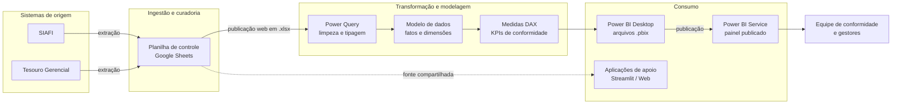

# Arquitetura da Solução

Documento de referência da arquitetura de dados do projeto **Conformidade de Registro de Gestão — Data Warehouse & Business Intelligence**.

---

## Sumário

- [Visão geral](#visão-geral)
- [Diagrama de fluxo de dados](#diagrama-de-fluxo-de-dados)
- [Camadas da arquitetura](#camadas-da-arquitetura)
- [Decisão arquitetural: publicação web em `.xlsx` sem gateway](#decisão-arquitetural-publicação-web-em-xlsx-sem-gateway)
- [Modelo de dados](#modelo-de-dados)
- [Infraestrutura e artefatos](#infraestrutura-e-artefatos)
- [Limitações conhecidas](#limitações-conhecidas)
- [Evolução proposta](#evolução-proposta)

---

## Visão geral

A solução transforma registros brutos extraídos dos sistemas estruturantes da administração financeira federal em painéis analíticos que apoiam a **análise diária de conformidade de registro de gestão** no Instituto Federal de Sergipe (IFS).

O escopo funcional abrange:

- Acompanhamento diário, mensal e anual do volume de documentos analisados, por unidade gestora e por conformador.
- Identificação de processos com restrição e respectivos códigos de restrição.
- Monitoramento de gargalos, tendências e distribuição de carga de trabalho.
- Apoio à decisão da gestão quanto à priorização de análises.

---

## Diagrama de fluxo de dados

---

## Camadas da arquitetura

### 1. Sistemas de origem

| Sistema | Papel | Responsável pela extração |
| --- | --- | --- |
| **SIAFI** | Sistema Integrado de Administração Financeira — registro dos atos e fatos da gestão | Equipe de conformidade |
| **Tesouro Gerencial** | Ferramenta de consulta e extração de dados orçamentários e financeiros | Equipe de conformidade |

Os dados são extraídos por meio de consultas e relatórios padronizados e transferidos para a planilha de controle.

### 2. Ingestão e curadoria

A planilha de controle, hospedada no **Google Sheets**, atua como camada de *staging* colaborativa. É o ponto em que a equipe registra e mantém os dados extraídos, incluindo:

- Identificação do documento e do processo SEI.
- Unidade gestora, servidor responsável e data de análise.
- Situação final da análise (sem restrição / com restrição) e códigos de restrição aplicados.

### 3. Transformação e modelagem

- **Power Query**: limpeza, padronização de tipos, tratamento de valores nulos e normalização de rótulos inconsistentes.
- **Modelo de dados**: organização em tabelas de fatos e dimensões, com relacionamentos que permitem análise por unidade gestora, tipo de documento, período e responsável.
- **Medidas DAX**: cálculo dos indicadores de conformidade, incluindo contagens, percentuais de restrição, médias de tempo de análise e comparativos temporais.

### 4. Consumo

- **Power BI Desktop** (`.pbix`): ambiente de desenvolvimento dos painéis.
- **Power BI Service**: publicação das versões estáveis para acesso das partes interessadas, com atualização agendada.
- **Aplicações de apoio**: protótipos que apoiam a análise individual, documentados em [`apps/`](../apps/).

---

## Decisão arquitetural: publicação web em `.xlsx` sem gateway

### Contexto

O Power BI Service precisa alcançar a planilha de controle para atualizar os painéis. A abordagem convencional exige a instalação de um **gateway de dados local** na rede da instituição para intermediar o acesso a fontes on-premises.

### Decisão

Utilizar a **publicação web do Google Sheets no formato `.xlsx`** como fonte de dados, dispensando o gateway.

### Justificativa

| Critério | Com gateway local | Com publicação web em `.xlsx` |
| --- | --- | --- |
| Infraestrutura | Servidor ou estação dedicada, sempre ligada | Nenhuma |
| Manutenção | Atualização, monitoramento e credenciais do gateway | Nenhuma |
| Atualização agendada | Sim | Sim |
| Dependência de TI | Alta | Baixa |
| Complexidade operacional | Alta | Baixa |

### Consequências

**Positivas**

- Arquitetura mais simples, sem componente de infraestrutura crítica.
- Menor custo de manutenção e menor dependência da área de TI.
- Implantação imediata e facilmente replicável em outras unidades.

**Negativas e mitigação**

| Risco | Mitigação adotada |
| --- | --- |
| Alterações na estrutura da planilha podem quebrar a consulta | Monitoramento diário da atualização; conferência de totais após cada publicação |
| Dependência da disponibilidade do serviço de publicação | Verificação diária do status de atualização do conjunto de dados |
| O `.xlsx` é uma cópia do estado atual, sem histórico de alterações | Registro formal das análises na planilha e versionamento dos `.pbix` neste repositório |

> Esta decisão está documentada de forma narrativa em [`dashboard/v8.md`](../dashboard/v8.md).

---

## Modelo de dados

A proposta de modelo relacional normalizado — com as entidades `Documento`, `Servidor`, `Unidade_Gestora`, `Histórico_Processamento` e `Anexo` — está descrita em [modelo-de-dados-mysql.md](./modelo-de-dados-mysql.md), incluindo o modelo entidade-relacionamento, o DDL de criação das tabelas e as consultas de análise.

Esse modelo representa a **evolução planejada** da camada de armazenamento, substituindo a planilha de controle por um banco de dados relacional.

---

## Infraestrutura e artefatos

| Camada | Tecnologia | Localização no repositório |
| --- | --- | --- |
| Extração e curadoria | Google Sheets | Referenciado em [fontes-de-dados.md](./fontes-de-dados.md) |
| Transformação | Power Query (M) | Contido nos arquivos `.pbix` |
| Modelagem e indicadores | DAX | Contido nos arquivos `.pbix` |
| Visualização | Power BI | [`dashboard/pbix/`](../dashboard/pbix/) |
| Aplicações de apoio | Python / Streamlit, React / TypeScript | [`apps/`](../apps/) |
| Análise exploratória | Jupyter Notebook | [`notebooks/`](../notebooks/) |
| Dados publicados | `.xlsx`, `.csv`, `.tsv` | [`dataset/`](../dataset/) |

---

## Limitações conhecidas

1. **Ausência de histórico de alterações** na camada de origem: a publicação web expõe apenas o estado atual da planilha, o que limita a auditoria de mudanças retroativas.
2. **Dupla entrada manual**: a extração do SIAFI e do Tesouro Gerencial e o preenchimento da planilha dependem de operação humana.
3. **Ausência de validação automática** de integridade referencial entre documentos, servidores e unidades gestoras.
4. **Acoplamento entre estrutura da planilha e consultas** do Power Query, sensível a reordenação ou renomeação de colunas.
5. **Rastreabilidade parcial**: a linhagem dos indicadores está documentada em texto, não de forma automatizada.

Essas limitações motivam as iniciativas descritas em [governanca-de-dados.md](./governanca-de-dados.md) e na seção de [evolução proposta](#evolução-proposta).

---

## Evolução proposta

| Iniciativa | Objetivo | Status |
| --- | --- | --- |
| Banco de dados relacional (MySQL/PostgreSQL) | Substituir a planilha por armazenamento transacional, com integridade referencial e histórico | Modelo desenhado — [modelo-de-dados-mysql.md](./modelo-de-dados-mysql.md) |
| Catálogo de dados | Formalizar fontes, campos, responsáveis e regras de negócio | Em estruturação — [fontes-de-dados.md](./fontes-de-dados.md) |
| Regras de qualidade automatizadas | Detectar nulos, duplicidades e inconsistências na ingestão | Proposto — [governanca-de-dados.md](./governanca-de-dados.md) |
| Alertas de desvio | Notificar proativamente sobre indicadores fora da faixa esperada (Power Automate) | Proposto |
| Análise preditiva | Antecipar tendências de não conformidade com R ou Python integrados ao Power BI | Proposto |
| Rastreabilidade automatizada | Registrar linhagem de cada indicador da origem ao painel | Proposto |

---

## Documentos relacionados

- [governanca-de-dados.md](./governanca-de-dados.md) — políticas de dados, papéis e qualidade
- [fontes-de-dados.md](./fontes-de-dados.md) — catálogo das fontes
- [modelo-de-dados-mysql.md](./modelo-de-dados-mysql.md) — modelo relacional proposto
- [metodologia.md](./metodologia.md) — processo de desenvolvimento
- [dashboard/README.md](../dashboard/README.md) — versões publicadas do painel
